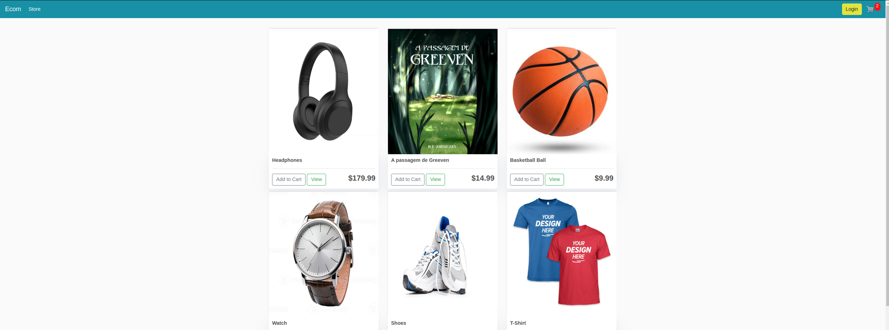
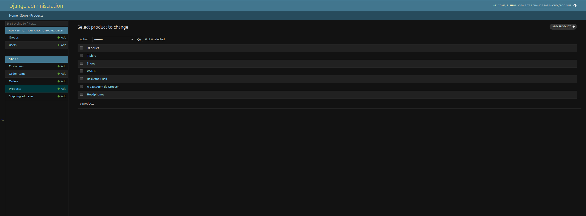
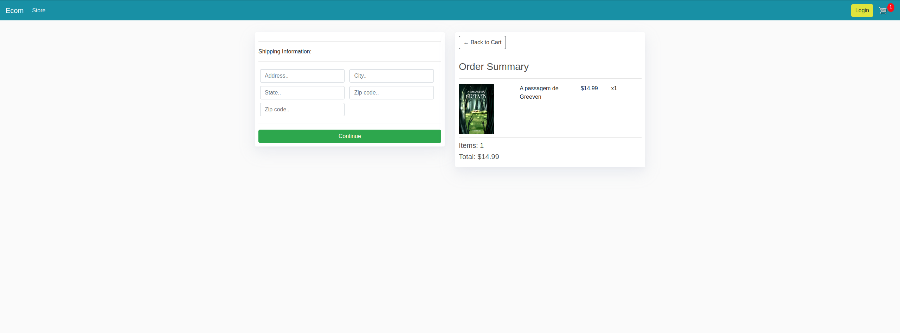
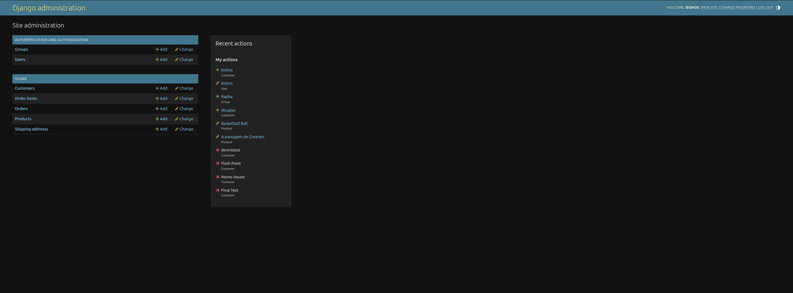

# Ecom - Django E-commerce Project




This is a full-featured e-commerce website built using Django, designed for managing products, handling customer orders, and providing a user-friendly shopping experience.

## Features:
- **Product Catalog**: View available products with detailed descriptions and pricing.
- **Shopping Cart**: Add, remove, and update quantities of products in the cart.
- **Order Management**: Users can place orders, view order history, and track order status.
- **User Authentication**: Register, login, and manage user accounts.
- **Admin Interface**: Manage products, orders, and users through Django's built-in admin panel.

## Requisitos

- Python 3.x
- Django 5.1.1
- SQLite (if you want to seen the data inside)
- pip for installing dependencies

## Instalação

1. Clone repo:
    ```bash
    git clone https://github.com/bishos123/Ecom.git
    ```
2. Open directory and run the ENV:
    ```bash
    cd Ecom/env/Scripts
    source activate
    ```
3. Install django and dependencies if needed:
    ```bash
    pip install django
    pip install -r requirements.txt
    ```
4. Apply database migrations
    ```bash
    python manage.py migrate
    ```
5. Create a superuser for admin access:
    ```bash
    python manage.py createsuperuser
    ```

6. Run the server:
    ```bash
    python manage.py runserver
    ```
7. Open your browser and navigate to 'http://127.0.0.1:8000'.

## MAPING


```bash
/Ecom
│
├── /Ecom/                       # Main configuration of the Django project
│   ├── __init__.py              # Package initialization file
│   ├── asgi.py                  # ASGI configuration file
│   ├── settings.py              # Project settings (Django)
│   ├── urls.py                  # Main URLs of the project
│   ├── wsgi.py                  # WSGI configuration file
│
├── /store/                      # Main application of the e-commerce
│   ├── /migrations/             # Database migrations (automatic)
│   ├── /static/                 # Static files (CSS, JS, images)
│   ├── /templates/              # HTML templates
│   │   └── /store/              # Templates specific to the store app
│   ├── admin.py                 # Admin configuration for the store app
│   ├── apps.py                  # Configuration for the store app
│   ├── models.py                # Database models
│   ├── tests.py                 # Automated tests for the app
│   ├── urls.py                  # URLs specific to the store app
│   ├── views.py                 # Logic for the views
│
├── /static/                     # Global static files for the project
│   └── /store/                  # Files specific to the store application
│
├── /templates/                  # Global templates for the project
│
├── db.sqlite3                   # SQLite database (default)
├── manage.py                    # Django management script
├── requirements.txt             # Project dependencies
│
└── README.md                    # Project documentation
```

## Other Screenshoots




